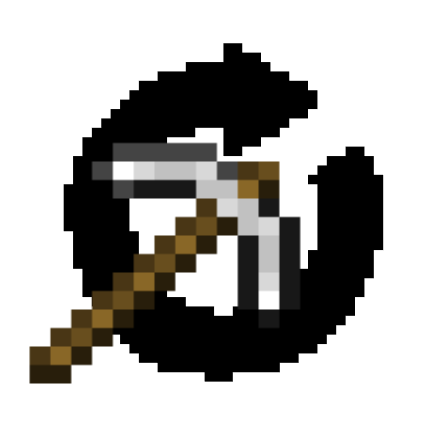

# Pick Relay

<p align="center">
  
</p>

**Automate the grind. Schedule your tools.**

Pick Relay is a client-side Minecraft mod for planning and executing ordered tool-relay sessions. Instead of choosing the "best" tool automatically, Pick Relay uses the exact tools, order, limits and safety rules configured by the player.

## Compatibility

- Minecraft **1.21.1**
- NeoForge **21.1.235+**
- Java **21** for development/building
- Client-side only

The server does not need Pick Relay installed.

## What Pick Relay does

Build a queue of up to **36 concrete tools** from your inventory and hotbar. Each queued tool keeps its own independent configuration:

- **Until Broken** — use the tool until it breaks.
- **Durability Budget** — consume a specific amount of real durability.
- **Blocks Broken** — stop after a specific number of successful block destructions.
- **Preserve at 1** — never intentionally use the tool past one remaining durability.

Supported tool categories are detected through vanilla item tags:

- Pickaxes
- Axes
- Shovels
- Hoes

Properly tagged modded tools are supported by the same mechanism.

## Mining modes

### Single Block

Captures the block coordinate under the crosshair when the session starts. Pick Relay only mines that coordinate. Looking elsewhere pauses mining without cancelling the session.

This mode is intended for compact generators where mining the backing block would damage the farm.

### Line Mining

Re-evaluates the block under the crosshair every cycle. Rotating the camera redirects mining immediately without stopping the session.

This mode is intended for advanced generators and linear work areas.

## Queue controls

- Left click an eligible inventory tool to add/remove it.
- Hold and drag across inventory slots to paint **ADD** or **REMOVE** selections.
- Left click a queued tool to inspect and configure that specific entry.
- Right click a queued tool to remove it.
- Drag queued tools to reorder them with swap/insert behaviour.
- Dropping a queued tool outside the queue removes only the queue entry, never the real ItemStack.

The queue is temporary. Closing Pick Relay before starting a session clears it. During an active session the queue becomes read-only.

## Tool tracking and relay behaviour

Inventory slots are treated as locations, not identities. Each queue entry has its own local identity and ItemStack fingerprint.

Pick Relay can therefore:

- follow a queued tool when the player moves it to another inventory/hotbar slot;
- respect queue order regardless of physical slot order;
- select tools already in the hotbar directly;
- move inventory tools into the first free hotbar slot;
- reuse the active hotbar slot as the relay slot when the hotbar is full;
- skip queued tools that are no longer present instead of terminating the whole session.

Pick Relay does not inject hidden UUIDs or custom data into the player's ItemStacks.

## Durability and block accounting

- **Blocks Broken** counts successful block destruction initiated by Pick Relay, not clicks, swings, drops or collected items.
- Hopper-fed farms work normally because drops do not need to enter the player inventory.
- **Durability Budget** counts observed durability actually consumed.
- Unbreaking only advances the durability budget when durability is really lost.
- Later Mending repairs do not erase durability consumption already recorded.
- **Preserve at 1** takes priority over production targets.

## Safety

The session is anchored to the player's position and dimension.

Pick Relay stops automatically if:

- the player is displaced, voluntarily or involuntarily;
- the player dies;
- the player disconnects/leaves the world;
- the player changes dimension;
- a relay/inventory state becomes unsafe to resolve;
- the queue finishes.

Camera rotation does **not** stop mining.

Opening chat, the normal player inventory or the pause menu does not intentionally cancel the session. The Pick Relay GUI can also be reopened while mining is active.

Manual stop is performed from the **Stop AFK Mining** button in the Pick Relay GUI.

## HUD

While active, Pick Relay displays a compact event-style status line above the hotbar showing:

- current tool / total tools;
- blocks or durability progress when relevant;
- Until Broken state;
- Preserve at 1 state;
- waiting state when no valid work block is currently available.

## Keybind

Pick Relay provides a configurable **Open Pick Relay** keybind. Its default binding is **Mouse Button 5**.

The same key opens the GUI while a session is active without stopping the relay.

## What Pick Relay does not do

Pick Relay deliberately does **not**:

- choose the best tool automatically;
- move or aim the player;
- search for blocks;
- pathfind;
- increase mining speed or reach;
- perform vein mining;
- repair tools;
- generate resources.

Minecraft and the server continue to handle normal mining rules, enchantments, drops and durability.

## Build

The repository includes local build helpers that select Java 21 and download the pinned Gradle distribution when necessary.

Windows:

```bat
build.bat
```

Linux/macOS:

```bash
./build.sh
```

The expected release artifact is:

```text
build/libs/pickrelay-1.21.1-1.0.1.jar
```

## Documentation

- [`docs/Pick-Relay-Especificacion.md`](docs/Pick-Relay-Especificacion.md) — final 1.0.0 functional/technical specification.
- [`docs/TESTING-1.0.1.md`](docs/TESTING-1.0.1.md) — 1.0.1 hotfix regression checklist.
- [`docs/PUBLISHING-ROADMAP.md`](docs/PUBLISHING-ROADMAP.md) — release preparation for Modrinth and CurseForge.

## Debug logging

Development logging is silent by default. Enable it with:

```text
-Dpickrelay.debug=true
```

This logs session transitions, inventory relay decisions, block progress and safety-related events.
